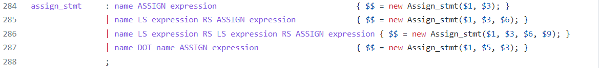
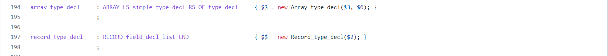

# Simple Pascal

[TOC]

## 序言

### 概述

本次实验小组基于C++语言设计并实现了一个Simple Pascal语言的编译系统，该系统以符合Pascal语言规范的代码文本为输入，输出为LLVM中间代码，并通过LLVM进行编译。该Simple Pascal编译器的设计实现涵盖词法分析、语法分析、语义分析、代码生成等阶段和环节，所使用的具体技术包括但不限于：

- Flex实现词法分析
- Bison实现语法分析
- LLVM实现中间代码生成、目标代码生成
- D3.js实现AST可视化

### 开发环境

- 操作系统：Ubuntu 20.04

- 编译环境：
  - Flex 2.6.4
  - Bison 3.5.1 (GNU Bison)
  - LLVM 10.0.0

- 编辑器：VSCode

### 文件说明

本次实验提交的文件及其说明如下：

- AST：语法树文件夹，存放头文件
- Doc：相关文档
- generator：中间代码生成文件夹
- pascal：pascal测试代码文件夹
- tester：测试程序文件夹
- VIS：语法树可视化文件夹
- CMakeList.txt：CMake配置文件
- main.cpp：主函数所在文件，主要负责调用词法分析器、语法分析器、代码生成器
- run.sh：中间代码生成脚本
- SimPascal.l：Flex源代码，主要实现词法分析，生成Token
- SimPascal.y：Yacc源代码，主要实现语法分析，生成抽象语法树
- Makefile：定义编译链接规则
- tree.json：基于AST生成的JSON文件
- clean.sh：文件清理脚本
- test.sh：编译测试脚本

### 组员分工

| 组员   | 具体分工                                |
| ------ | --------------------------------------- |
| 曾帅   | 词法分析，语法分析，AST可视化，语法测试 |
| 王异鸣 | 语义分析，中间代码生成                  |
| 杨淇森 | 中间代码生成，语法测试                  |


## 词法分析

词法分析是将字符序列转化为Token的阶段，本实验使用Flex完成，词法分析文件的格式较为固定，并且基本由语言特性决定，没有太多实现难点。

### 正规表达式描述

#### 关键词部分

在此实验中，Pascal的大部分关键词我们都进行了支持，并且在lex文件识别部分首先就应该识别关键词，下面将关键词罗列如下：


识别关键词部分的实现代码如下：

```c++
"and"       { return AND; }
"array"     { return ARRAY; }
"begin"     { return PBEGIN; }
"case"      { return CASE; }
"const"     { return CONST; }
"div"       { return DIV; }
"do"        { return DO; }
"downto"    { return DOWNTO; }
"else"      { return ELSE; }
"end"       { return END; }
"for"       { return FOR; }
"function"  { return FUNCTION; }
"goto"      { return GOTO; }
"if"        { return IF; }
"of"        { return OF; }
"or"        { return OR; }
"packed"    { return PACKED; }
"procedure" { return PROCEDURE; }
"program"   { return PROGRAM; }
"record"    { return RECORD; }
"repeat"    { return REPEAT; }
"then"      { return THEN; }
"to"        { return TO; }
"type"      { return TYPE; }
"until"     { return UNTIL; }
"var"       { return VAR; }
"while"     { return WHILE; }
```

#### 运算符与、界符

同样需要有限识别的还有运算符和界定符，此语法支持的运算符与界定符罗列如下：


根据上表就能完成运算符与界定符部分识别的代码：

```c++
"("    { return LP; }
")"    { return RP; }
"["    { return LS; }
"]"    { return RS; }
"."    { return DOT; }
","    { return COMMA; }
":"    { return COLON; }
"*"    { return MUL; }
"/"    { return DIV; }
"<>"   { return NE; }
"not"  { return NOT; }
"+"    { return PLUS; }
"-"    { return MINUS; }
">="   { return GE; }
"<="   { return LE; }
">"    { return GT; }
"<"    { return LT; }
"="    { return EQ; }
":="   { return ASSIGN; }
"mod"  { return MOD; }
".."   { return DOTDOT; }
";"    { return SEMI; }
```

#### 常数与系统调用

接下来就要识别语言中的系统函数/过程，常数和数据类型的关键词，罗列如下：

* SYS_CON: "false", "maxint", "true" 
* SYS FUNCT: "abs", "chr" , "odd", "ord" , "pred", "sqr", "sqrt" , "succ"
* SYS_PROC: "write", "writeln"
* SYS_TYPE: "boolean" , "char" , "integer" , "real"
* READ: “read”, "readln"
* INTEGER: 整数常数值
* REAL：实数常数值
* CHAR：字符常数值

这部分关键词按类识别，并且将具体的内容存放到yylval结构体中，等待yacc文件中进行进一步的处理。

```c++
"boolen"|"char"|"integer"|"real"            { 
                                                yylval.sval = new string(yytext);
                                                return SYS_TYPE; 
                                            }
"true"|"false"|"maxint"                     { 
                                                yylval.sval = new string(yytext);
                                                return SYS_CON;
                                            }   
"ads"|"chr"|"odd"|"ord"|"pred"|"sqr"|"sqrt"|"succ" {
                                                yylval.sval = new string(yytext);
                                                return SYS_FUNCT;
                                            }
"write"|"writeln"                           {
                                                yylval.sval = new string(yytext);
                                                return SYS_PROC;
                                            }
"read"|"readln"                             {
                                                yylval.sval = new string(yytext);
                                                return READ;
                                            }
```

遇到整数类型，将其识别为INTEGER并存值：

```c++
[+-]?[0-9]+                 {
                                std::cout << "Integer: " << yytext << std::endl;
                                yylval.ival = atoi(yytext);
                                return INTEGER;
                            }
```

遇到实数类型，将其识别为REAL并存值

```c++
[+-]?[0-9]+\.[0-9]+         {
                                std::cout << "Real: " << yytext << std::endl;
                                yylval.dval = atof(yytext);
                                return REAL;
                            }
```

遇到单引号包裹的内容，根据长度识别为空/CHAR字符/STRING字符串三种类型，并存值

```c++
\'(\\.|[^'\\])*\'           {
                                std::string tmp = yytext;
                                if (tmp.size() == 2) {
                                    yylval.cval = '\0';
                                    return CHAR;
                                }
                                else if (tmp.size() == 3) {
                                    std::cout << "Char: " << yytext[1] << std::endl;
                                    yylval.cval = yytext[1];
                                    return CHAR;
                                }
                                else {
                                    std::string tmp = yytext;
                                    tmp.erase(0, 1);
                                    tmp.erase(tmp.size() - 1, 1);
                                    std::cout << "String: " << tmp << std::endl;
                                    yylval.sval = new string(tmp);
                                    return STRING;
                                }
                                
                            }
```


### 数据结构

词法分析部分使用到的主要数据结构就是yylval的union结构，此结构将在语法分析部分详细阐述。

```c++
%union {
    int ival;
    double dval;
    string *sval;
    char cval;

    Identifier *id;
    Name_list *name_list;
    Program *program;
    Program_head *program_head;
    Routine *routine;
    Routine_head *routine_head;
    Routine_body *routine_body;
    Const_part *const_part;
    Type_part *type_part;
    Var_part *var_part;
    Var_decl *var_decl;
    Var_decl_list *var_decl_list;
    Routine_part *routine_part;
    Const_expr_list *const_expr_list;
    Const_value *const_value;
    Type_decl_list *type_decl_list;
    Type_definition *type_definition;
    Type_decl *type_decl;
    Simple_type_decl *simple_type_decl;
    Array_type_decl *array_type_decl;
    Record_type_decl *record_type_decl;
    Field_decl_list *field_decl_list;
    Field_decl *field_decl;
    Function_decl *function_decl; 
    Function_head *function_head;
    Para_decl *para_type_list;
    Para_decl_list *para_decl_list;
    Va_para_list *val_para_list;
    Va_para_list *var_para_list;
    Stmt_list *stmt_list;
    Stmt *stmt;
    Expression *expression;
    Expression_list *expression_list;
    Direction *direction;
    Case_expr_list *case_expr_list;
    Case_expr *case_expr;
    Args_list *args_list;
}
```


## 语法分析

语法分析过程主要时利用前一部分生成的token序列建立抽象语法树，并且在这一阶段，我们使用了Yacc工具，走的是下图上面的路径


### 原理

yacc（Yet Another Compiler Compiler），是Unix/Linux上一个用来生成编译器的编译器（编译器代码生成器）。yacc生成的编译器主要是用C语言写成的语法解析器（Parser），需要与词法解析器Lex一起使用，再把两部分产生出来的C程序一并编译。Yacc的工作流程如下所示：


Yacc文件主要由三部分组成，声明区、规则区和程序区，文件结构如下所示：

```c
declarations
%%
rules
%%
programs
```

### 文法描述

#### Node类

Node类是一个抽象类，是AST的抽象结点，也即所有其他AST结点的父节点。拥有提供代码生成接口和可视化接口的两个虚函数。

```c++
class Node {
public:
    virtual ~Node() {}
    virtual llvm::Value *codegen(CodeGenerator &codeGenerator) = 0;
    virtual string Vis() { return ""; };
};
```

#### Expression类

Expression类是产生值的语句的父类，也即表达式类。而在此类中，拥有一个私有成员变量记录此类为何种类型的表达式，方便后续进一步处理。

```c++
class Expression : public Node {
    exp_type etype;
};
```

而在Yacc中，yylval结构体包括了Epression类类型的几个非终结符，借由这几个非终结符来解释与Epression类有关的文法描述：

```c++
%type<expression> expression expr term factor
```

从下图可以看到，epression类主要涉及到常见的二元运算，并且考虑到了各操作符的优先级，在此文法中，大小比较符的优先级小于加法、减法和或运算，小于乘法、除法、求和、取余运算。每个二元运算的识别都会生成一个Binary\_expression类。


而factor除了一般的变量之外，还有一些系统函数或调用和NOT，负号这类高优先级操作符

```c
factor          : name                                                
                | name LP args_list RP                              
                | SYS_FUNCT                                         
                | SYS_FUNCT LP args_list RP                             
                | const_value                                         
                | LP expression RP                                     
                | NOT factor                                       
                | MINUS factor                  
                | name LS expression RS                             
                | name LS expression RS LS expression RS 
                | name DOT name
                ;
```

而二元操作类比较简单，只需要将两个操作数和一个操作符保存到类中即可

```c++
class Binary_expression : public Expression {
private:
    Binary_op op;
    Expression *lexpression;
    Expression *rexpression;
public:
    Binary_expression(Binary_op op, Expression *lexpression, Expression *rexpression) : op(op), lexpression(lexpression), rexpression(rexpression) {}
    llvm::Value *codegen(CodeGenerator &codeGenerator);
    string Vis();
};
```

#### Statement类

Statement类为语句类，此类主要实现赋值语句 ，函数调用语句，if/while/repeat/while/for/case等条件控制语句，goto语句。

```c++
class Stmt : public Node {
private:
    int label = -1;

public:
    void Setlabel(int label) {
        this->label = label;
    }
    virtual llvm::Value *codegen(CodeGenerator &codeGenerator) = 0;
};
```

下面将会结合文法来分析此类，stmt分为有标记的语句和没有标记的语句，方便Goto进行处理。


赋值语句类是对语句类的一个继承，主要实现了变量的赋值，数组的赋值和Record的赋值，对应文法罗列如下。

```c++
class Assign_stmt : public Stmt {
private:
    Identifier *lid;
    Expression *lexpression;
    Expression *rexpression;
    Identifier *fid;
    Expression *fexpression;
public:
    Assign_stmt(Identifier *lid, Expression *rexpression) : lid(lid), rexpression(rexpression) {}
    Assign_stmt(Identifier *lid, Expression *lexpression, Expression *rexpression) : lid(lid), lexpression(lexpression), rexpression(rexpression) {}
    Assign_stmt(Identifier *lid, Expression *rexpression, Identifier *fid) : lid(lid), rexpression(rexpression), fid(fid) {}
    Assign_stmt(Identifier *lid, Expression *lexpression, Expression *fexpression, Expression *rexpression) : lid(lid), lexpression(lexpression), fexpression(fexpression), rexpression(rexpression) {}
    llvm::Value *codegen(CodeGenerator &codeGenerator);
    string Vis();
};
```



过程调用类是负责调用自行定义的过程或者系统调用过程，拥有参数列表和过程名作为私有成员变量，对应的文法调用也比较简单，如下所示：

```c++
class Proc_stmt : public Stmt {
private:
    Identifier *id;
    Args_list *args_list;
public:
    Proc_stmt(Identifier *id) : id(id) {}
    Proc_stmt(Identifier *id, Args_list *args_list) : id(id), args_list(args_list) {}
    llvm::Value *codegen(CodeGenerator &codeGenerator);
    string Vis();
};
```


if条件控制类有条件判断表达式expression，执行语句stmt和else部分（可选）作为参数，文法分析与类定义如下：

```c++
class If_stmt : public Stmt {
private:
    Expression *expression;
    Stmt *stmt;
    Stmt *else_stmt;
public:
    If_stmt(Expression *expression, Stmt *stmt) : expression(expression), stmt(stmt) {}
    If_stmt(Expression *expression, Stmt *stmt, Stmt *else_stmt) : expression(expression), stmt(stmt), else_stmt(else_stmt) {}
    llvm::Value *codegen(CodeGenerator &codeGenerator);
    string Vis();
};
```


其他语句类与上述语句类大同小异，在此不再赘述。


#### Identifier类

Id类用于存放标识符，只含有一个string类型的成员变量作为标识符名。

```c++
class Identifier : public Expression {
    string name;
public:
    Identifier(string name) : name(name) {}
    llvm::Value *codegen(CodeGenerator &codeGenerator);
    string Vis();
};
```

yacc中如果识别到lex中的ID类，直接创建新的标识符类


#### Program类

Program类也是此实验中比较核心的类，主要由函数头和rountine类这两个成员变量类构成，并且是以DOT结尾，在建立这一类别时，需要将它赋值给root，作为AST的根节点而存在。

```c++
class Program : public Node {
private:
    Program_head *head;
    Routine *routine;
public:
    Program(Program_head *head, Routine *routine) : head(head), routine(routine) {}
    llvm::Value *codegen(CodeGenerator &codeGenerator);
    string Vis();
};
```


其中函数头类主要负责存放Program名，只由一个string类型的成员变量组成，比较简单。

```c++
class Program_head : public Node {
private:
    string name;
public:
    Program_head(string name) : name(name) {}
    llvm::Value *codegen(CodeGenerator &codeGenerator);
    string Vis();
};
```

Routine类就是整个Program的精华，同样含有routine头和routine体两个成员变量，其中routine头与对应文法如下所示，可以看到routine头包括常数申明部分const_part，类型申明部分type_part，变量申明部分var_part和函数/过程申明部分routine_part（可以在此part申明自定义函数或过程）。


下面会具体分析这几部分。

#### 常量申明类

const_part负责常数申明部分，以name = constvalue的形式存在，constvalue即为本编译器支持的所有类型，涵盖基本内建类型：整数、浮点数、字符、字符串和布尔量类型。

主要的部分如下：


```c++
class Const_value : public Expression {
private:
    Base_type base_type;

    union value {
        int int_value;
        double double_value;
        char char_value;
        string string_value;
        bool bool_value;
    public:
        value() { new(&string_value) string(); }
        ~value() { string_value.~string(); }
    } Value;
public:
    Const_value(Base_type base_type, int value) : base_type(base_type) {
        this->Value.int_value = value;
    }
    Const_value(Base_type base_type, double value) : base_type(base_type) {
        this->Value.double_value = value;
    }
    Const_value(Base_type base_type, char value) : base_type(base_type) {
        this->Value.char_value = value;
    }
    Const_value(Base_type base_type, string value) : base_type(base_type) {
        this->Value.string_value = value;
    }
    Const_value(Base_type base_type, bool value) : base_type(base_type) {
        this->Value.bool_value = value;
    }

    Const_value *operator-() {
        switch (base_type) {
        case S_INT:
            return new Const_value(S_INT, -Value.int_value);
        case S_REAL:
            return new Const_value(S_REAL, -Value.double_value);
        case S_CHAR:
            return new Const_value(S_CHAR, -Value.char_value);
        case S_BOOLEAN:
            return new Const_value(S_BOOLEAN, !Value.bool_value);
        default:
            return nullptr;
        }
    }
    llvm::Value *codegen(CodeGenerator &codeGenerator);
    llvm::Constant *get_constant(CodeGenerator &codeGenerator);
    string Vis();
    Base_type get_type(){ return base_type;};
    int get_value();
};
```

值得注意的是，为方便后续操作，此constvalue类中还实现了-操作符的重载。

#### 类型定义类

类型定义是Pascal中比较特别的一个部分，能够实现对一个类型赋“别名”，此类主要由TYPE关键词和一系列类型申明语句组成，类定义比较平凡在此不过多展开。


此类最重要的还是类型定义语句类，本编译器支持三种类型的定义，一是简单类型，二是数组类型，三是record类型，基本涵盖pascal的所有类型。下面会对每种类型做具体分析。


首先是简单类型，主要由基本内建类型，用户自定义类型(Id)，范围类型和枚举类型组成。基本类型也即整数、实数、字符类型和布尔类型，范围类型也包括数组的范围和枚举类型的范围。


常数范围类型

```c++
class Const_range : public Node {
private:
    Const_value *lower;
    Const_value *upper;
    size_t size;
public:
    Const_range(Const_value *lower, Const_value *upper) : lower(lower), upper(upper) {}
    llvm::Value *codegen(CodeGenerator &codeGenerator);
    string Vis();
    llvm::Value *get_abs_index(llvm::Value *originIdx, CodeGenerator &codeGenerator);
    void cal_size(){
        int s;
        if(lower->get_type() == upper->get_type()){
            s = upper->get_value() - lower->get_value() + 1;
        }
        if(s <= 0){
            print("Invalid range");
        }
        size = s;
    }
    size_t get_size(){ return size; };
};
```

枚举类型

```c++
class Enum_Type : public Node {
private:
    Name_list *name_list;
public:
    Enum_Type(Name_list *name_list) : name_list(name_list) {}
    llvm::Value *codegen(CodeGenerator &codeGenerator);
    string Vis();
};
```

枚举范围类型

```c++
class Enum_range : public Node {
private:
    Identifier *lower_id;
    Identifier *upper_id;
public:
    Enum_range(Identifier *lower_id, Identifier *upper_id) : lower_id(lower_id), upper_id(upper_id) {}
    llvm::Value *codegen(CodeGenerator &codeGenerator);
    string Vis();
};
```

其次是数组申明和record申明语句类，这两类的格式都比较固定，只需要把对应参数传入即可。



```c++
class Array_type_decl : public Node {
private:
    Simple_type_decl *simple_type_decl;
    Type_decl *type_decl;
public:
    Array_type_decl(Simple_type_decl *simple_type_decl, Type_decl *type_decl) : simple_type_decl(simple_type_decl), type_decl(type_decl) {}
    llvm::Value *codegen(CodeGenerator &codeGenerator);
    string Vis();
    int get_size(){ return simple_type_decl->get_size(); };
    int get_sub_size();
    Pas_type get_idx_type();
    llvm::Type *get_llvm_type(CodeGenerator &codeGenerator);
    llvm::Type *get_sub_llvm_type(CodeGenerator &codeGenerator);
    llvm::Constant *get_init_value(CodeGenerator &codeGenerator);
    llvm::Value* get_idx(llvm::Value* originIdx, CodeGenerator &codeGenerator){return simple_type_decl->get_idx(originIdx, codeGenerator);};
    llvm::Value* get_sub_idx(llvm::Value* originIdx, CodeGenerator &codeGenerator);
};
```

```c++
class Record_type_decl : public Node {
private:
    Field_decl_list *field_decl_list;
public:
    Record_type_decl(Field_decl_list *field_decl_list) : field_decl_list(field_decl_list) {}
    llvm::Value *codegen(CodeGenerator &codeGenerator);
    string Vis();
};
```

#### 函数/过程定义类

函数和过程定义格式比较固定，区别是过程没有返回值，而函数拥有返回值，方便起见我组将它们划分到同一类中，仅仅以有无返回值做区分。函数的定义包括函数名，函数参数和返回值类型，将它们存入对应的类成员变量即可。

```c++
class Function_head : public Node {
private:
    Identifier *id;
    Para_decl_list *parameters;
    Simple_type_decl *return_type;
public:
    Function_head(Identifier *id, Para_decl_list *parameters, Simple_type_decl *return_type) : id(id), parameters(parameters), return_type(return_type) {}
    Function_head(Identifier *id, Para_decl_list *parameters) : id(id), parameters(parameters) {}
    Identifier *getId() { return id; }
    Para_decl_list *getParameters() { return parameters; }
    Simple_type_decl *getReturnType() { return return_type; }
    llvm::Value *codegen(CodeGenerator &codeGenerator);
    string Vis();
};

class Function_decl : public Node {
private:
    Function_head *function_head;
    Routine *subroutine;
public:
    Function_decl(Function_head *function_head, Routine *subroutine) : function_head(function_head), subroutine(subroutine) {}
    Function_head *getFunctionHead() { return function_head; }
    Routine *getSubroutine() { return subroutine; }
    llvm::Value *codegen(CodeGenerator &codeGenerator);
    string Vis();
};
```


篇幅有限，其他大同小异或者没有比较单独讲的类在此省略，对编译器的理解也没有太大的影响。


### AST树的可视化

语法分析部分主要建立起了AST，接住没每个类的可视化接口和，D3.js可视化工具，我将整个AST树在网页端显示了出来，下面阐述可视化方法的介绍。

可视化过程主要是输出一个json文件的过程，json文件的格式如下：

```json
{ "name" : "xxx", 
 	"children" : [ ... ]
}
```

将json文件输出后即可使用D3.js的一些模版html文件对json进行处理和显示，具体的实现效果将在测试点中展示。输出json文件的函数如下：

```c++
inline string Out(string name, vector<string> vec) {
    string res = "";
    res += "{";
    res += "\"name\" : \"" + name + "\",";
    res += "\"children\" : [";
    for (int i = 0; i < vec.size(); i++) {
        res += vec[i];
        if (i != vec.size() - 1) {
            res += ",";
        }
    }
    res += "]";
    res += "}";
    return res;
}
```

以一段很小的程序为例，可以比较明显的验证正确性

```pascal
program hello;
var
  e: char;

begin
  e := 'e';
  writeln(e);
end.
```


## 语义分析与中间代码生成

### LLVM概述

LLVM是构架编译器(compiler)的框架系统，以C++编写而成，用于优化以任意程序语言编写的程序的编译时间(compile-time)、链接时间(link-time)、运行时间(run-time)以及空闲时间(idle-time)。

由于LLVM高度模块化地特性，我们可以方便地将语法结构转化为中间代码，并且更加容易地排查问题所在。除此之外，使用LLVM编写出来的程序结构也更加清晰，同时具有较强的可读性。

### LLVM IR

在使用LLVM时，我们需要首先将源代码转化为LLVM IR(Intermediate Representation，中间表示)。IR连接着编译器前端和编译器后端。我们只需要将自己设计的语言转化为IR，就可以轻松使用LLVM的各种编译优化、JIT支持、目标代码生成等功能。

LLVM IR包含了以下核心内容：

- Module类，Module可以理解为一个完整的编译单元。一般来说，这个编译单元就是一个源码文件，如一个后缀为cpp的源文件。
- Function类，这个类顾名思义就是对应于一个函数单元。Function可以描述两种情况，分别是函数定义和函数声明。
- BasicBlock类，这个类表示一个基本代码块，“基本代码块”就是一段没有控制流逻辑的基本流程，相当于程序流程图中的基本过程（矩形表示）。
- Instruction类，指令类就是LLVM中定义的基本操作，比如加减乘除这种算数指令、函数调用指令、跳转指令、返回指令等等。
- Context：提供用户创建变量等对象的上下文环境，尤其在多线程环境下至关重要
- IRBuilder：提供创建LLVM指令并将其插入基础块的API

通过以上的模块和接口，我们就可以较为便捷地生成我们所需要的IR代码。

### 运行环境设计

我们使用了CodeGenerator类来设置运行环境。其包含以下成员：

- 上下文变量context
- 构造器builder
- 模块实例module
- 主函数指针mainFunction
- 地址空间addrSpace
- 函数栈functions
- 预定义函数指针read，write
- 数组表arrMap
- 生成中间代码函数generateCode，供main函数调用
- 函数栈处理函数getFunc、pushFunc、popFunc
- 功能函数CreateEntryBlockAlloca，用于为变量分配空间
- 功能函数getValue，用于寻找以定义的变量
- 函数setWrite和setRead，用于对输入输出函数进行初始化

```c++
class CodeGenerator{
public:
    LLVMContext context;
    IRBuilder<> builder;
    Module *module;
    Function *mainFunction;
    unsigned int addrSpace;
    vector<Function*> functions;
    Function *read, *write;
    map<string, Array_type_decl*> arrMap;
    CodeGenerator():builder(context) {
        module = new Module("main", context);
        addrSpace = module->getDataLayout().getAllocaAddrSpace();
    }
    void generateCode(Program& root);
    Function* getFunc(){return functions.back();}
    void pushFunc(Function* func){functions.push_back(func);}
    void popFunc(){functions.pop_back();}

    AllocaInst *CreateEntryBlockAlloca(Function *TheFunction, StringRef VarName, Type* type);
    Value* getValue(string & name);
    Function* setWrite();   
    Function* setRead();
};
```

generateCode函数通过调用root的接口函数实现IR的生成，最后将中间代码输出

```c++
void CodeGenerator::generateCode(Program& root) {
    cout<<"Begin Gen"<<endl;
    root.codegen(*this);
    cout<<"Finish Gen"<<endl;
    
    module->print(llvm::errs(), nullptr);
}
```

CreateEntryBlockAlloca函数取自LLVM的官方教程

```c++
AllocaInst *CodeGenerator::CreateEntryBlockAlloca(Function *TheFunction, StringRef VarName, Type* type){
    IRBuilder<> TmpB(&TheFunction->getEntryBlock(), TheFunction->getEntryBlock().begin());
    return TmpB.CreateAlloca(type, nullptr, VarName);
}
```

getValue函数查询变量表以获得对应名称的变量，优先查找本地变量

```c++
Value* CodeGenerator::getValue(string & name){
    Value *ret;
    for (auto iter = functions.rbegin(); iter != functions.rend(); iter++){
        ret=(*iter)->getValueSymbolTable()->lookup(name);
        if (ret != nullptr) return ret;
    }
    ret = module->getGlobalVariable(name);
    if (ret == nullptr) cout<<"Undefined variable: "<<name<<endl;
    else cout<<"Find "<<name<<" in global"<<endl;
    return ret;
}
```

read与write函数通过调用内置的C函数实现

```c++
Function* CodeGenerator::setWrite()
{
    vector<Type*> types;
    types.push_back(builder.getInt8PtrTy());
    auto printf_type = FunctionType::get(builder.getInt32Ty(), makeArrayRef(types), true);
    auto func = Function::Create(printf_type, Function::ExternalLinkage, Twine("printf"), module);
    func->setCallingConv(CallingConv::C);
    return func;
}

Function* CodeGenerator::setRead()
{
    auto type = FunctionType::get(builder.getInt32Ty(), true);
    auto func = Function::Create(type, Function::ExternalLinkage, Twine("scanf"), module);
    func->setCallingConv(CallingConv::C);
    return func;
}
```

### 程序总体架构

在program类的codegen函数中，我们需要实现程序的总体架构并调用成员变量的函数以生成整个程序的中间代码。

```c++
Value *Program::codegen(CodeGenerator &codeGenerator) {
    print("Program::codegen");
    vector<Type*> argTypes;
    FunctionType * funcType = FunctionType::get(codeGenerator.builder.getInt32Ty(), makeArrayRef(argTypes), false);
    codeGenerator.mainFunction = Function::Create(funcType, GlobalValue::ExternalLinkage, "main", codeGenerator.module);
    BasicBlock * basicBlock = BasicBlock::Create(codeGenerator.context, "entrypoint", codeGenerator.mainFunction, 0);
    
    codeGenerator.pushFunc(codeGenerator.mainFunction);
    codeGenerator.builder.SetInsertPoint(basicBlock);

    codeGenerator.write = codeGenerator.setWrite();
    codeGenerator.read = codeGenerator.setRead();

    routine->setGlobalValues();
    routine->codegen(codeGenerator);
    codeGenerator.builder.CreateRet(codeGenerator.builder.getInt32(0));
    codeGenerator.popFunc();
    
    return nullptr;
}
```

在这一函数中，我们首先设置了main函数作为主函数，并将其压入函数栈。之后我们设置了代码块并初始化了read与write函数。然后我们调用routine的codegen函数以生成主体代码，最后设置整数零作为返回值。

在Routine中，我们同样依次调用类中成员的同一函数以实现中间代码的生成。

```c++
Value *Routine::codegen(CodeGenerator &codeGenerator) {
    print("Routine::codegen");
    head->codegen(codeGenerator);
    body->codegen(codeGenerator);
    return nullptr;
}

Value *Routine_head::codegen(CodeGenerator &codeGenerator) {
    print("Routine_head::codegen");
    if(const_part!=nullptr) const_part->codegen(codeGenerator);
    if(type_part!=nullptr) type_part->codegen(codeGenerator);
    if(var_part!=nullptr) var_part->codegen(codeGenerator);
    for (auto routine : *routine_part) {
        routine->codegen(codeGenerator);
    }
    return nullptr;
}

Value *Routine_body::codegen(CodeGenerator &codeGenerator) {
    print("Routine_body::codegen");
    for (auto statement : *stmt_list) {
        statement->codegen(codeGenerator);
    }
    return nullptr;
}
```

### 常量与变量的定义与获取

#### 常量定义

对于每一个常量的定义，我们根据其属于本地还是全局采用不同的方式进行初始化

```c++
Value *Const_expr::codegen(CodeGenerator &codeGenerator) {
    print("Const_expr");
    Constant *value = const_value->get_constant(codeGenerator);
    if(is_global){
        return new GlobalVariable(*codeGenerator.module, value->getType(), true, GlobalValue::ExternalLinkage, value, id->name);
    } else {
        auto alloc = codeGenerator.CreateEntryBlockAlloca(codeGenerator.getFunc(), id->name, value->getType());
        return codeGenerator.builder.CreateStore(value, alloc);
    }
}
```

在初始化时，我们需要获取等号后的常量值，我们通过get_constant函数实现这一操作

```c++
Constant *Const_value::get_constant(CodeGenerator &codeGenerator){
    print("get_constant");
    switch (base_type) {
        case Base_type::S_INT:
            return codeGenerator.builder.getInt32(Value.int_value);
        case Base_type::S_REAL:
            return llvm::ConstantFP::get(codeGenerator.builder.getDoubleTy(), Value.double_value);
        case Base_type::S_CHAR:
            return codeGenerator.builder.getInt8(Value.char_value);
        case Base_type::S_BOOLEAN:
            return codeGenerator.builder.getInt1(Value.bool_value);
        default:
            return nullptr;
    }
}
```

常量共有四种基本类型，其中：

- 内置类型Int，Char，Bool分别使用32、8、1位的Int类型

- Real使用Double类型

除此之外，当在statement中用到数字时，我们同样使用这种方法获得他们的值，只是将返回类型修改为了Value*。

#### 变量定义

和常量定义类似，我们根据其属于本地还是全局采用不同的变量定义方式。在初始化时，四种基本变量类型操作与常量定义较为类似，此处额外介绍数组定义方式。

在程序识别到数组时，会在codeGenerator维护的arrMap中加入此数组节点的指针以供后续数组索引使用。

```c++
Value *Var_decl::codegen(CodeGenerator &codeGenerator) {
    print("Var_decl");
    Value *value = type_decl->codegen(codeGenerator);// if array, value is an element of type
    llvm::Type *varType;
    for(auto name : *name_list) {
        Constant *constant;
        if(type_decl->get_type() == Pas_type::ARRARY){
            print("Add array map");
            codeGenerator.arrMap[name->name] = type_decl->get_array_decl();
            varType = type_decl->get_llvm_type(codeGenerator);
            constant = type_decl->get_init_value(codeGenerator, nullptr);
            print("get constant");
        }else{
            varType = value->getType();
            constant = Constant::getNullValue(value->getType());
        }
        if(is_global){
            new GlobalVariable(*codeGenerator.module, varType, false, GlobalValue::ExternalLinkage, constant, name->name);
        } else {
            auto alloc = codeGenerator.CreateEntryBlockAlloca(codeGenerator.getFunc(), name->name, value->getType());
            codeGenerator.builder.CreateStore(value, alloc);
        }
    }
    return nullptr;
}
```

此外`get_llvm_type()`和`get_init_value()`将返回以llvm::Value为基础单元的数组类型和初始值（初始值默认为0），支持二维数组定义。

```c++
llvm::Constant *Type_decl::get_init_value(CodeGenerator &codeGenerator, Const_value* v){
    if(v != nullptr){
        //TBD
    }else{
        if(simple_type_decl) {
            return Constant::getNullValue(simple_type_decl->get_llvm_type(codeGenerator));
        } else if(array_type_decl) {
            return array_type_decl->get_init_value(codeGenerator);
        } else if(record_type_decl) {
            //TBD
        } else {
            return nullptr;
    }
    }
    return nullptr;
}
```

```c++
Type* Type_decl::get_llvm_type(CodeGenerator &codeGenerator){
    print("Type_decl");
    if(simple_type_decl) {
        return simple_type_decl->get_llvm_type(codeGenerator);
    } else if(array_type_decl) {
        return array_type_decl->get_llvm_type(codeGenerator);
    } else if(record_type_decl) {
        //TBD
    } else {
        return nullptr;
    }
}
```

#### 数组引用

数组引用在本程序中通过函数`Array_Access()`实现

```c++
Value *Array_access::codegen(CodeGenerator &codeGenerator) {
    print("Array_access::codegen");
    return codeGenerator.builder.CreateLoad(getPtr(codeGenerator), "arrPtr");
}
```

其中`getPtr()`提供了数组元素在内存中的地址，在取值和赋值中都十分重要。

```c++
Value *Array_access::getPtr(CodeGenerator &codeGenerator) {
    print("get array item pointer");
    std::string name = id->name;
    Value *arrValue = codeGenerator.getValue(name), *idxValue;
    Array_type_decl *arr = codeGenerator.arrMap[name];
    if(arr->get_idx_type() == Pas_type::CONSTRANGE){
        print("idx is const range");
        idxValue = arr->get_idx(index->codegen(codeGenerator), codeGenerator);
    }else{
        throw runtime_error("idx is not const range");
    }
    vector<Value*> idxs;
    idxs.push_back(codeGenerator.builder.getInt32(0));
    idxs.push_back(idxValue);
    ArrayType *arrType = (ArrayType*)(arr->get_llvm_type(codeGenerator));
    if(etype == DARRAY_ACCESS){
        int size1, size2; // actually not be used
        size1 = arr->get_size();
        size2 = arr->get_sub_size();
        //get first-level Ptr
        arrValue = codeGenerator.builder.CreateInBoundsGEP(arrType, arrValue, idxs);
        //Update arrType to next-level arrayType
        arrType = (ArrayType*)(arr->get_sub_llvm_type(codeGenerator));
        idxs.pop_back();
        // update index
        idxValue = arr->get_sub_idx(findex->codegen(codeGenerator), codeGenerator);
        idxs.push_back(idxValue);
    }
   
    return codeGenerator.builder.CreateInBoundsGEP(arrType, arrValue, idxs);
}
```

### 表达式的运算

我们需要通过二元运算获得表达式的值。

```c++
Value *Binary_expression::codegen(CodeGenerator &codeGenerator) {
    print("Binary_expression::codegen");
    Value *lv = lexpression->codegen(codeGenerator);
    Value *rv = rexpression->codegen(codeGenerator);
    return Binary_operation(lv, op, rv, codeGenerator);
}
```

由于LLVM中已经集成了丰富的二元操作接口，我们只需要直接调用即可完成运算。

```c++
Value *Binary_operation(Value* lv, Binary_op op, Value* rv, CodeGenerator &codeGenerator){
    print("binary operation");
    bool flag = lv->getType()->isDoubleTy() || rv->getType()->isDoubleTy();

    switch (op) {
        case Binary_op::S_PLUS:
            if (flag) return codeGenerator.builder.CreateFAdd(lv, rv, "addtmp");
            return codeGenerator.builder.CreateAdd(lv, rv, "addtmp");
        case Binary_op::S_MINUS:
            if (flag) return codeGenerator.builder.CreateFSub(lv, rv, "subtmp");
            return codeGenerator.builder.CreateSub(lv, rv, "subtmp");
        case Binary_op::S_MUL:
            if (flag) return codeGenerator.builder.CreateFMul(lv, rv, "multmp");
            return codeGenerator.builder.CreateMul(lv, rv, "multmp");
        case Binary_op::S_DIV:
            if (flag) return codeGenerator.builder.CreateFDiv(lv, rv, "divtmp");
            return codeGenerator.builder.CreateSDiv(lv, rv, "divtmp");
        case Binary_op::S_MOD:
            return codeGenerator.builder.CreateSRem(lv, rv, "modtmp");
        case Binary_op::S_AND:
            return codeGenerator.builder.CreateAnd(lv, rv, "andtmp");
        case Binary_op::S_OR:
            return codeGenerator.builder.CreateOr(lv, rv, "ortmp");
        case Binary_op::S_GE:
            return codeGenerator.builder.CreateICmpSGE(lv, rv, "getmp");
        case Binary_op::S_GT:
            return codeGenerator.builder.CreateICmpSGT(lv, rv, "gtmp");
        case Binary_op::S_LE:
            return codeGenerator.builder.CreateICmpSLE(lv, rv, "letmp");
        case Binary_op::S_LT:
            return codeGenerator.builder.CreateICmpSLT(lv, rv, "ltmp");
        case Binary_op::S_EQ:
            return codeGenerator.builder.CreateICmpEQ(lv, rv, "eqtmp");
        case Binary_op::S_NE:
            return codeGenerator.builder.CreateICmpNE(lv, rv, "netmp");
        case Binary_op::S_NOT:
            return codeGenerator.builder.CreateNot(lv, "nottmp");
        default:
            return nullptr;
    }
}
```

### 函数定义

函数的定义包含函数头与函数主体两个部分，其中，函数头包含函数名，函数参数与返回类型。

为了实现函数，我们需要在函数头的代码生成中首先根据函数名与返回类型完成函数的预定义。同时，我们还需要识别出函数每一个参数的类型，并为函数的参数开辟一块空间，为运行时参数的读入做好准备。

```c++
Value *Function_head::codegen(CodeGenerator &codeGenerator) {
    print("Function_head");
    vector<Type*> types;
    if (parameters) {
        for(auto para : *parameters) {
            if(para->getVaParaList()->getIsVarPara()){
                types.insert(types.end(), para->getVaParaList()->getNameList()->size(), para->getSimpleTypeDecl()->codegen(codeGenerator)->getType());
            } else {
                types.insert(types.end(), para->getVaParaList()->getNameList()->size(), para->getSimpleTypeDecl()->codegen(codeGenerator)->getType());
            }
        }
    }
    Type *retType;
    if(return_type) {
        Value *ret = return_type->codegen(codeGenerator);
        if(ret) retType = ret->getType();
        else retType = codeGenerator.builder.getVoidTy();
    } else {
        retType = codeGenerator.builder.getVoidTy();
    }
    FunctionType *funcType = FunctionType::get(retType, types, false);
    Function *function = Function::Create(funcType, GlobalValue::InternalLinkage, id->name, codeGenerator.module);
    codeGenerator.pushFunc(function);
    BasicBlock *newBlock = BasicBlock::Create(codeGenerator.context, "entrypoint", function, nullptr);
    codeGenerator.builder.SetInsertPoint(newBlock);

    Function::arg_iterator iter = function->arg_begin();
    if (parameters) {
        for (auto para : *parameters) {
            for (auto name : *para->getVaParaList()->getNameList()){
                Value *alloc = nullptr;
                if(para->getVaParaList()->getIsVarPara()){
                    alloc = codeGenerator.CreateEntryBlockAlloca(function, name->name, para->getSimpleTypeDecl()->codegen(codeGenerator)->getType());
                    codeGenerator.builder.CreateStore(iter, alloc);
                    iter++;
                } else {
                    alloc = codeGenerator.CreateEntryBlockAlloca(function, name->name, para->getSimpleTypeDecl()->codegen(codeGenerator)->getType());
                    codeGenerator.builder.CreateStore(iter, alloc);
                    iter++;
                }
            }
        }
    }
    if(retType != codeGenerator.builder.getVoidTy()){
        codeGenerator.CreateEntryBlockAlloca(function, id->name, retType);
    }
    return function;
}
```

而对于函数主体部分，代码的生成方式与主函数主体部分的生成方式相同，因此只需要调用同一函数即可。最后，我们还需要根据返回值的类型创建该函数的返回值。

```c++
Value *Function_decl::codegen(CodeGenerator &codeGenerator) {
    print("Function_decl");
    Value *function = function_head->codegen(codeGenerator);
    subroutine->codegen(codeGenerator);

     if (!function_head->getReturnType()){
        codeGenerator.builder.CreateRetVoid();
    } else if(!function_head->getReturnType()->codegen(codeGenerator)){
        codeGenerator.builder.CreateRetVoid();
    } else {
        codeGenerator.builder.CreateRet(function_head->getId()->codegen(codeGenerator));
    }
    
    codeGenerator.popFunc();
    codeGenerator.builder.SetInsertPoint(&(codeGenerator.getFunc())->getBasicBlockList().back());
    return function;
}
```

### 赋值语句

在赋值语句中，我们需要将右表达式的值赋给左表达式，分为标识符赋值与数组赋值。前者直接查询到变量的地址，后者需要根据下标和下限计算偏移量再获取元素的地址。

在进行赋值时，我们还需要判断左值与右值的类型是否相等，若不等，则需要首先对右值进行强制类型转换。

```c++
alue *Assign_stmt::codegen(CodeGenerator &codeGenerator) {
    print("Assign_stmt::codegen");
    if((!lexpression)&&(!fid)){ //id assignment
        print("Assign_stmt::codegen: id");
        Value *val = lid->codegen(codeGenerator);
        Value *lval = codeGenerator.getValue(lid->name);
        Value *rval = rexpression->codegen(codeGenerator);
        if(val->getType()!=rval->getType()){
            if(val->getType()->isIntegerTy()){
                rval = codeGenerator.builder.CreateFPToUI(rval, codeGenerator.builder.getInt32Ty());
            }
            else if(val->getType()->isDoubleTy()){
                rval = codeGenerator.builder.CreateUIToFP(rval, codeGenerator.builder.getDoubleTy());
            }
        }
        return codeGenerator.builder.CreateStore(rval, lval);
    } else if(fexpression){ //2d array assignment
        print("Assign_stmt::codegen: 2-d array");
        return codeGenerator.builder.CreateStore(rexpression->codegen(codeGenerator), (new Array_access(lid, lexpression, fexpression))->getPtr(codeGenerator));
    } else if(lexpression) { // array assignment
        print("Assign_stmt::codegen: array");
        return codeGenerator.builder.CreateStore(rexpression->codegen(codeGenerator), (new Array_access(lid, lexpression))->getPtr(codeGenerator));
    } 
    return nullptr;
}
```

### 函数调用

#### 自定义函数调用

函数调用的过程相对较为简单，只需要取出相应的函数，并且将变量压入数组，即可直接调用函数。

```c++
Value *Func_stmt::codegen(CodeGenerator &codeGenerator) {
    print("Func_stmt::codegen");
    Function *function = codeGenerator.module->getFunction(id->name);
    if (function == nullptr) throw runtime_error("Function not found");
    vector<Value*> args;
    Function::arg_iterator iter =  function->arg_begin();

    if (args_list) {
        for (auto arg : *args_list){
            args.push_back(arg->codegen(codeGenerator));
            iter++;
        }
    }
    
    if(function->getReturnType()!=codeGenerator.builder.getVoidTy()){
        return codeGenerator.builder.CreateCall(function, args, "calltmp");
    } else {
        return codeGenerator.builder.CreateCall(function, args);
    }
}
```

#### 系统函数调用

系统函数主要包括read、write和writeln，其中write与writeln的区别仅在于最后是否需要输出换行。

输入输出函数实际上是通过调用C语言中的printf与scanf函数实现，为此，我们需要首先准备好输入的参数，之后调用对应的函数。

```c++
Value *Sysproc_stmt::codegen(CodeGenerator &codeGenerator) {
    print("Sysproc_stmt::codegen");
    string Format = "";
    vector<Value*> sysargs;
    switch (func){
        case SysFunc::S_READLN:
        {
            auto arg = args_list->at(0);
            Value *addr, *argValue;
            if(arg->etype == ARRAY_ACCESS){
                print("array access");
                addr = dynamic_cast<Array_access*>(arg)->getPtr(codeGenerator);
            } else if(arg->etype == DARRAY_ACCESS){
                print("2d array access");
                addr = dynamic_cast<Array_access*>(arg)->getPtr(codeGenerator);
            } else{
                addr = codeGenerator.getValue(dynamic_cast<Identifier*>(arg)->name);
            }
            argValue = arg->codegen(codeGenerator);
            if (argValue->getType() == codeGenerator.builder.getInt32Ty()||
                argValue->getType() == codeGenerator.builder.getInt1Ty()) Format = Format + "%d";
            else if (argValue->getType() == codeGenerator.builder.getInt8Ty()) Format = Format + "%c";
            else if (argValue->getType()->isDoubleTy()) Format = Format + "%lf";
            else throw logic_error("Read Type Error!");
            sysargs.push_back(addr);
            sysargs.insert(sysargs.begin(), codeGenerator.builder.CreateGlobalStringPtr(Format));
            return codeGenerator.builder.CreateCall(codeGenerator.read, sysargs, "read");
            break;
        }
        case SysFunc::S_WRITE:
        {
            for (auto arg : *args_list){
                Value* argValue = arg->codegen(codeGenerator);
                if (argValue->getType() == codeGenerator.builder.getInt32Ty()||
                    argValue->getType() == codeGenerator.builder.getInt1Ty()) Format = Format + "%d";
                else if (argValue->getType() == codeGenerator.builder.getInt8Ty()) Format = Format + "%c";
                else if (argValue->getType()->isDoubleTy()) Format = Format + "%.1lf";
                else throw logic_error("Write Type Error!");

                sysargs.push_back(argValue);
            }
            auto strConst = ConstantDataArray::getString(codeGenerator.context, Format.c_str());
            auto StrVar = new GlobalVariable(*(codeGenerator.module), ArrayType::get(codeGenerator.builder.getInt8Ty(), Format.size() + 1), true, GlobalValue::ExternalLinkage, strConst, ".str");
            auto nullvalue = Constant::getNullValue(codeGenerator.builder.getInt32Ty());
            Constant* indices[] = {nullvalue, nullvalue};
            auto reference = ConstantExpr::getGetElementPtr(StrVar->getType()->getElementType(), StrVar, indices);

            sysargs.insert(sysargs.begin(), reference);
            return codeGenerator.builder.CreateCall(codeGenerator.write, makeArrayRef(sysargs), "write");
            break;
        }
        case SysFunc::S_WRITELN:
        {
            if (args_list) {
                for (auto arg : *args_list){
                    Value* argValue = arg->codegen(codeGenerator);
                    if (argValue->getType() == codeGenerator.builder.getInt32Ty()||
                        argValue->getType() == codeGenerator.builder.getInt1Ty()) Format = Format + "%d";
                    else if (argValue->getType() == codeGenerator.builder.getInt8Ty()) Format = Format + "%c";
                    else if (argValue->getType()->isDoubleTy()) Format = Format + "%.1lf";
                    else throw logic_error("Write Type Error!");
                    
                    sysargs.push_back(argValue);
                }
            }
            Format += "\n";
            auto strConst = ConstantDataArray::getString(codeGenerator.context, Format.c_str());
            auto StrVar = new GlobalVariable(*(codeGenerator.module), ArrayType::get(codeGenerator.builder.getInt8Ty(), Format.size() + 1), true, GlobalValue::ExternalLinkage, strConst, ".str");
            auto nullvalue = Constant::getNullValue(codeGenerator.builder.getInt32Ty());
            Constant* indices[] = {nullvalue, nullvalue};
            auto reference = ConstantExpr::getGetElementPtr(StrVar->getType()->getElementType(), StrVar, indices);
            
            sysargs.insert(sysargs.begin(), reference);
            Value *res = codeGenerator.builder.CreateCall(codeGenerator.write, makeArrayRef(sysargs), "write");
            return res;
            break;
        }
        default:
            return nullptr;
            break;
    }
}
```

### 分支语句

#### if语句

if语句可以被抽象为三个基础块：

- then：条件为真执行的基础块，结束之后跳转到merge基础块
- else：条件为假执行的基础块，结束之后跳转到merge基础块，对于没有else部分的分支语句我们创建一个空的else基础块来达到简化代码的目的
- merge：if语句结束之后的基础块，作为后面代码的插入点

我们只需要根据条件语句的结果，让程序跳转至不同的代码块即可。

```c++
Value *If_stmt::codegen(CodeGenerator &codeGenerator) {
    print("If_stmt::codegen");
    Value *cond = expression->codegen(codeGenerator);
    if (cond->getType() != codeGenerator.builder.getInt1Ty()) throw logic_error("If condition type error!");
    cond = codeGenerator.builder.CreateICmpNE(cond, ConstantInt::get(codeGenerator.context, APInt(1, 0)), "ifcond");

    Function *function = codeGenerator.getFunc();
    BasicBlock *mergeblock = BasicBlock::Create(codeGenerator.context, "ifcont", function);
    BasicBlock *thenblock = BasicBlock::Create(codeGenerator.context, "then", function);
    BasicBlock *elseblock = BasicBlock::Create(codeGenerator.context, "else", function);
    codeGenerator.builder.CreateCondBr(cond, thenblock, elseblock);

    codeGenerator.builder.SetInsertPoint(thenblock);
    stmt->codegen(codeGenerator);
    codeGenerator.builder.CreateBr(mergeblock);
    thenblock = codeGenerator.builder.GetInsertBlock();

    codeGenerator.builder.SetInsertPoint(elseblock);
    if(else_stmt) else_stmt->codegen(codeGenerator);
    codeGenerator.builder.CreateBr(mergeblock);
    elseblock = codeGenerator.builder.GetInsertBlock();

    codeGenerator.builder.SetInsertPoint(mergeblock);

    return nullptr;
}

```

#### case语句

case语句可以看做是多个if语句的集合。每一个case分支都单独作为一个代码块，若是条件不满足就跳转至下一个代码块。在某一块执行完成后，则跳转至merge块以执行之后的语句。

```c++
Value *Case_stmt::codegen(CodeGenerator &codeGenerator) {
    print("case_stmt::codegen");
    Function *function = codeGenerator.getFunc();
    Value *expValue = expression->codegen(codeGenerator);
    vector<BasicBlock *> swtichblocks, caseblocks;
    BasicBlock *mergeblock = BasicBlock::Create(codeGenerator.context, "casecont", function);
    for(int i=0; i<(*case_expr_list).size(); i++) {
        swtichblocks.push_back(BasicBlock::Create(codeGenerator.context, "switch"+to_string(i), function));
        caseblocks.push_back(BasicBlock::Create(codeGenerator.context, "case"+to_string(i), function));
    }
    int i=0;
    for (auto expr : *case_expr_list) {
        if(i==0) codeGenerator.builder.CreateBr(swtichblocks[0]);
        codeGenerator.builder.SetInsertPoint(swtichblocks[i]);
        Value *cond = expr->getValue(codeGenerator);
        cond = codeGenerator.builder.CreateICmpEQ(cond, expValue, "casecond");
        if(expr!=case_expr_list->back()) {
            codeGenerator.builder.CreateCondBr(cond, caseblocks[i], swtichblocks[i+1]);
        } else {
            codeGenerator.builder.CreateCondBr(cond, caseblocks[i], mergeblock);
        }

        codeGenerator.builder.SetInsertPoint(caseblocks[i]);
        expr->codegen(codeGenerator);
        codeGenerator.builder.CreateBr(mergeblock);
        i++;
    }

    codeGenerator.builder.SetInsertPoint(mergeblock);
    return nullptr;
}
```

### 循环语句

#### repeat语句

repeat语句的实现包含以下代码块：

- body块：repeat语句循环执行的主体代码。
- cond块：判断是否满足循环条件。
- merge块：repeat语句结束后，后续代码的插入点。

```c++
Value *Repeat_stmt::codegen(CodeGenerator &codeGenerator) {
    print("Repeat_stmt::codegen");

    Function *function = codeGenerator.getFunc();
    BasicBlock *mergeblock = BasicBlock::Create(codeGenerator.context, "repeatcont", function);
    BasicBlock *bodyblock = BasicBlock::Create(codeGenerator.context, "body", function);
    BasicBlock *condblock = BasicBlock::Create(codeGenerator.context, "cond", function);

    codeGenerator.builder.CreateBr(bodyblock);
    codeGenerator.builder.SetInsertPoint(bodyblock);

    for(auto stmt : *stmt_list){
        stmt->codegen(codeGenerator);
    }

    codeGenerator.builder.CreateBr(condblock);
    bodyblock = codeGenerator.builder.GetInsertBlock();

    codeGenerator.builder.SetInsertPoint(condblock);
    Value *cond = expression->codegen(codeGenerator);
    if (cond->getType() != codeGenerator.builder.getInt1Ty()) throw logic_error("Repeat condition type error!");
    cond = codeGenerator.builder.CreateICmpNE(cond, ConstantInt::get(codeGenerator.context, APInt(1, 1)), "repeatcond");
    codeGenerator.builder.CreateCondBr(cond, bodyblock, mergeblock);

    codeGenerator.builder.SetInsertPoint(mergeblock);
    return nullptr;
}
```

#### while语句

while语句与repeat类似，同样包含三个代码块：

- body块：while语句循环执行的主体代码。
- cond块：判断是否满足循环条件。
- merge块：while语句结束后，后续代码的插入点。

与repeat不同的是，while语句首先判断条件再跳入循环。

```c++
Value *While_stmt::codegen(CodeGenerator &codeGenerator) {
    print("while_stmt::codegen");
    Function *function = codeGenerator.getFunc();
    BasicBlock *mergeblock = BasicBlock::Create(codeGenerator.context, "whilecont", function);
    BasicBlock *bodyblock = BasicBlock::Create(codeGenerator.context, "body", function);
    BasicBlock *condblock = BasicBlock::Create(codeGenerator.context, "cond", function);

    codeGenerator.builder.CreateBr(condblock);
    codeGenerator.builder.SetInsertPoint(condblock);
    Value *cond = expression->codegen(codeGenerator);
    if (cond->getType() != codeGenerator.builder.getInt1Ty()) throw logic_error("While condition type error!");
    cond = codeGenerator.builder.CreateICmpNE(cond, ConstantInt::get(codeGenerator.context, APInt(1, 0)), "whilecond");
    codeGenerator.builder.CreateCondBr(cond, bodyblock, mergeblock);

    codeGenerator.builder.SetInsertPoint(bodyblock);
    stmt->codegen(codeGenerator);

    codeGenerator.builder.CreateBr(condblock);
    bodyblock = codeGenerator.builder.GetInsertBlock();

    codeGenerator.builder.SetInsertPoint(mergeblock);
    return nullptr;
}
```

#### for语句

for语句与repeat和while类似，不同的地方在于for中使用了一个变量控制循环轮次，因此我们需要根据遍历的方向每次增或减该变量的值，直到达到退出循环的要求。

```c++
Value *For_stmt::codegen(CodeGenerator &codeGenerator) {
    print("for_stmt::codegen");
    Function *function = codeGenerator.getFunc();
    BasicBlock *mergeblock = BasicBlock::Create(codeGenerator.context, "forcont", function);
    BasicBlock *bodyblock = BasicBlock::Create(codeGenerator.context, "body", function);
    BasicBlock *condblock = BasicBlock::Create(codeGenerator.context, "cond", function);
    Value *intValue = codeGenerator.getValue(id->name);
    Value *initValue = Out_expression->codegen(codeGenerator);
    Value *endValue = In_expression->codegen(codeGenerator);
    codeGenerator.builder.CreateStore(initValue, intValue);

    codeGenerator.builder.CreateBr(condblock);
    codeGenerator.builder.SetInsertPoint(condblock);
    bool dirValue = direction->getDir();
    Value *condValue = id->codegen(codeGenerator);
    Value *cond;
    if(dirValue) {
        cond = codeGenerator.builder.CreateICmpSLE(condValue, endValue, "forcond");
    } else {
        cond = codeGenerator.builder.CreateICmpSGE(condValue, endValue, "forcond");
    }
    cond = codeGenerator.builder.CreateICmpNE(cond, ConstantInt::get(codeGenerator.context, APInt(1, 0)), "forcond");
    codeGenerator.builder.CreateCondBr(cond, bodyblock, mergeblock);
    condblock = codeGenerator.builder.GetInsertBlock();

    codeGenerator.builder.SetInsertPoint(bodyblock);
    stmt->codegen(codeGenerator);
    Value *nextValue = codeGenerator.builder.CreateAdd(condValue, codeGenerator.builder.getInt32(dirValue?1:-1), "next");
    codeGenerator.builder.CreateStore(nextValue, intValue);
    codeGenerator.builder.CreateBr(condblock);
    bodyblock = codeGenerator.builder.GetInsertBlock();

    codeGenerator.builder.SetInsertPoint(mergeblock);
    return nullptr;
}
```

## 目标代码生成

目标代码生成可以直接借助LLVM后端的llvm-as和llc工具进行生成，具体的命令是

```shell
llvm-as *.ll -o *.bc
llc -I=(arch) *.bc -o *.s
```

以下面快速排序测试点为例，可以看到在x86\_64架构下的输出目标代码文件为

```assembly
	.text
	.file	"main"
	.globl	main                    # -- Begin function main
	.p2align	4, 0x90
	.type	main,@function
main:                                   # @main
	.cfi_startproc
# %bb.0:                                # %entrypoint
	pushq	%rbp
	.cfi_def_cfa_offset 16
	pushq	%rbx
	.cfi_def_cfa_offset 24
	pushq	%rax
	.cfi_def_cfa_offset 32
	.cfi_offset %rbx, -24
	.cfi_offset %rbp, -16
	movl	$.L__unnamed_1, %edi
	movl	$N, %esi
	xorl	%eax, %eax
	callq	scanf
	movl	N(%rip), %ebx
	decl	%ebx
	movl	$0, i(%rip)
	.p2align	4, 0x90
.LBB0_2:                                # %cond
                                        # =>This Inner Loop Header: Depth=1
	movl	i(%rip), %ebp
	cmpl	%ebx, %ebp
	jg	.LBB0_3
# %bb.1:                                # %body
                                        #   in Loop: Header=BB0_2 Depth=1
	movslq	i(%rip), %rax
	leaq	arr(,%rax,4), %rsi
	movl	$.L__unnamed_2, %edi
	xorl	%eax, %eax
	callq	scanf
	incl	%ebp
	movl	%ebp, i(%rip)
	jmp	.LBB0_2
.LBB0_3:                                # %forcont
	movl	N(%rip), %esi
	decl	%esi
	xorl	%edi, %edi
	callq	sort
	movl	N(%rip), %ebx
	decl	%ebx
	movl	$0, i(%rip)
	.p2align	4, 0x90
.LBB0_5:                                # %cond13
                                        # =>This Inner Loop Header: Depth=1
	movl	i(%rip), %ebp
	cmpl	%ebx, %ebp
	jg	.LBB0_6
# %bb.4:                                # %body12
                                        #   in Loop: Header=BB0_5 Depth=1
	movslq	i(%rip), %rax
	movl	arr(,%rax,4), %esi
	movl	$.str, %edi
	xorl	%eax, %eax
	callq	printf
	incl	%ebp
	movl	%ebp, i(%rip)
	jmp	.LBB0_5
.LBB0_6:                                # %forcont11
	xorl	%eax, %eax
	addq	$8, %rsp
	.cfi_def_cfa_offset 24
	popq	%rbx
	.cfi_def_cfa_offset 16
	popq	%rbp
	.cfi_def_cfa_offset 8
	retq
.Lfunc_end0:
	.size	main, .Lfunc_end0-main
	.cfi_endproc
                                        # -- End function
	.p2align	4, 0x90         # -- Begin function sort
	.type	sort,@function
sort:                                   # @sort
	.cfi_startproc
# %bb.0:                                # %entrypoint
	subq	$24, %rsp
	.cfi_def_cfa_offset 32
	movl	%edi, 8(%rsp)
	movl	%esi, 12(%rsp)
	movl	$0, 16(%rsp)
	movl	$0, (%rsp)
	movl	$0, 4(%rsp)
	movl	$0, 20(%rsp)
	cmpl	%esi, %edi
	jge	.LBB1_4
# %bb.1:                                # %then
	movslq	8(%rsp), %rax
	movl	arr(,%rax,4), %ecx
	movl	%ecx, 16(%rsp)
	movl	%eax, (%rsp)
	leal	1(%rax), %ecx
	movl	12(%rsp), %r8d
	jmp	.LBB1_2
	.p2align	4, 0x90
.LBB1_7:                                # %ifcont16
                                        #   in Loop: Header=BB1_2 Depth=1
	incl	%ecx
.LBB1_2:                                # %cond
                                        # =>This Inner Loop Header: Depth=1
	movl	%ecx, 4(%rsp)
	movl	4(%rsp), %ecx
	cmpl	%r8d, %ecx
	jg	.LBB1_3
# %bb.5:                                # %body
                                        #   in Loop: Header=BB1_2 Depth=1
	movslq	4(%rsp), %rdx
	movl	arr(,%rdx,4), %edx
	cmpl	16(%rsp), %edx
	jge	.LBB1_7
# %bb.6:                                # %then17
                                        #   in Loop: Header=BB1_2 Depth=1
	movslq	4(%rsp), %rdx
	movl	arr(,%rdx,4), %esi
	movl	%esi, 20(%rsp)
	movl	(%rsp), %edi
	incl	%edi
	movslq	%edi, %rdi
	movl	arr(,%rdi,4), %eax
	movl	%eax, arr(,%rdx,4)
	movl	%esi, arr(,%rdi,4)
	movslq	(%rsp), %rax
	leal	1(%rax), %edx
	movslq	%edx, %rdx
	movl	arr(,%rax,4), %eax
	movl	%eax, arr(,%rdx,4)
	movslq	(%rsp), %rax
	movl	%esi, arr(,%rax,4)
	incl	(%rsp)
	jmp	.LBB1_7
.LBB1_3:                                # %forcont
	movl	8(%rsp), %edi
	movl	(%rsp), %esi
	decl	%esi
	callq	sort
	movl	(%rsp), %edi
	incl	%edi
	movl	12(%rsp), %esi
	callq	sort
.LBB1_4:                                # %ifcont
	addq	$24, %rsp
	.cfi_def_cfa_offset 8
	retq
.Lfunc_end1:
	.size	sort, .Lfunc_end1-sort
	.cfi_endproc
                                        # -- End function
	.type	N,@object               # @N
	.bss
	.globl	N
	.p2align	2
N:
	.long	0                       # 0x0
	.size	N, 4

	.type	i,@object               # @i
	.globl	i
	.p2align	2
i:
	.long	0                       # 0x0
	.size	i, 4

	.type	arr,@object             # @arr
	.globl	arr
	.p2align	4
arr:
	.zero	40004
	.size	arr, 40004

	.type	.L__unnamed_1,@object   # @0
	.section	.rodata.str1.1,"aMS",@progbits,1
.L__unnamed_1:
	.asciz	"%d"
	.size	.L__unnamed_1, 3

	.type	.L__unnamed_2,@object   # @1
.L__unnamed_2:
	.asciz	"%d"
	.size	.L__unnamed_2, 3

	.type	.str,@object            # @.str
	.section	.rodata,"a",@progbits
	.globl	.str
.str:
	.asciz	"%d\n"
	.size	.str, 4

	.section	".note.GNU-stack","",@progbits

```


## 测试案例

### 快速排序

#### 题目要求

输入N个数，将其从小到大排序，输出排序后的N个数（详见验收细则）。

#### 实现思路

第一步，通过for循环和readln系统函数读入N个数，使用一维整型数组保存；
第二部，通过调用sort子过程将N个数排序；
第三部，通过for循环和writeln系统函数输出N个数。

#### 实现细节

核心在于递归实现的快速排序算法——sort子过程。算法可以分为3步：
第一步，将front和back之间的数字分为3个组成部分：[小于pivot的数，pivot，大于pivot的数]；
第二步，对小于pivot的数再次调用sort子过程；
第三步，对大于pivot的数再次调用sort子过程。

代码如下：

```pascal
program quicksort;
var
  N, i: integer;
  arr: array [0..10000] of integer;

procedure sort(front: integer; back: integer);
var
    p: integer;
    index: integer;
    pos: integer;
    temp: integer;

begin
    if front < back then
    begin
        p := arr[front];
        index := front;
        for pos := front + 1 to back do
            begin
                if arr[pos] < p then
                begin
                    temp := arr[pos];
                    arr[pos] := arr[index + 1];
                    arr[index + 1] := temp;
                    
                    temp := arr[index + 1];
                    arr[index + 1] := arr[index];
                    arr[index] := temp;

                    index := index + 1;
                end; 
            end;
        sort(front, index - 1);
        sort(index + 1, back);
    end;
end;

begin
    readln(N);
    for i := 0 to N - 1 do
        readln(arr[i]);
    sort(0, N - 1);

    for i := 0 to N - 1 do
        writeln(arr[i]);
end.
```

#### 测试结果


#### AST生成树

json文件附在测试代码文件夹中


### 矩阵乘法

#### 题目要求

输入矩阵的行数M和列数N，然后按照矩阵形状输入M*N个数，第二个矩阵的输入与此相同。计算两个矩阵的乘积，最后将乘积矩阵输出（详见验收细则）。

#### 实现思路

第一步，通过for循环读入矩阵数据，使用二维整型数组保存； 第二步，通过三层for循环嵌套计算乘积矩阵； 第三部，通过两层for循环嵌套输出乘积矩阵。

#### 实现细节

代码如下：

```pascal
program matrix;
var
    row1, col1, row2, col2: integer;
    A, B: array [0..30] of array [0..30] of integer;
    C: array [0..30] of array [0..30] of integer;
    i, j, k: integer;

begin
    readln(row1);
    readln(col1);
    for i := 0 to row1 - 1 do
    begin
        for j := 0 to col1 - 1 do
            readln(A[i][j]);
    end;

    readln(row2);
    readln(col2);
    for i := 0 to row2 - 1 do
    begin
        for j := 0 to col2 - 1 do
            readln(B[i][j]);        
    end;

    if col1 <> row2 then
        write('I', 'n', 'c', 'o', 'm', 'p', 'a', 't', 'i', 'b', 'l', 'e', ' ', 'D', 'i', 'm', 'e', 'n', 's', 'i', 'o', 'n', 's', '\n')
    else
    begin
        for i := 0 to row1 - 1 do
        begin
            for j := 0 to col2 - 1 do
                C[i][j] := 0;
        end;
        for i := 0 to row1 - 1 do
        begin
            for j := 0 to col2 - 1 do
                for k := 0 to row2 - 1 do
                    C[i][j] := C[i][j] + A[i][k] * B[k][j];
        end;

        for i := 0 to row1 - 1 do
        begin
            for j := 0 to col2 - 1 do
                write(C[i][j]) 10;
            writeln;
        end;
    end;
end.
```

#### 测试结果


#### AST树


### 选课助手

#### 题目要求

每行按照(课程名称,学分,前置课程,成绩)的格式输入，计算GPA、尝试学分、已修学分、剩余学分、推荐课程并输出。值得注意的是，前置课程中可能会输入该培养方案从未出现过的课程，即修读了专业培养方案之外的课程，此时应该将其计入GPA，但是在计算推荐课程时视为从未修读该培养方案之外的课程。

#### 实现思路

第一步，通过while循环和readln系统函数读入每一行课程的四元组并分别存储到对应数据结构中，其中课程名称用编号通过一维数组存储、学分为一维整型数组、预置课程为二维整形数组、成绩为一维字符数组；
第二步，计算GPA、尝试学分、已修学分、剩余学分；
第三步，在所有课程中检测每一个前置课程是否已经取得学分，如果前置课程都已经取得学分而本课程尚未取得，则推荐本课程。

#### 实现细节

代码如下：

```pascal
program QSort;
  const
    MaxN = 100;
  var
    validCourse : array[0..999] of integer;
    crediet : array[0..999] of integer;
    grade : array[0..999] of char;
    require : array[0..999] of array[0..999] of integer;
    pass : array[0..999] of integer;
    n : integer;
    num : integer;
    cNum : integer;
    idx : integer;
    validIdx : integer;
    c : char;
    ch : char;
    binary : char;
    totalCrediet : integer;
    attemptCrediet : integer;
    getCrediet : integer;
    remainCredite : integer;
    gradeTmp : integer;
    GPA : real;
    flag : integer;
    ok : integer;
    gradeReal : real;
    attemptCredietReal : real;

  begin
    totalCrediet := 0;
    attemptCrediet := 0;
    getCrediet := 0;
    remainCredite := 0;
    gradeTmp := 0;
    validIdx := 0;
    readln(c);
    while c = 'c' do
    begin
      readln(n);
      validCourse[validIdx] := n;
      validIdx := validIdx + 1;
      readln(ch);
      readln(num);
      crediet[n] := num;
      totalCrediet := totalCrediet + num;
      readln(ch);
      readln(ch);
      idx := 0;
      while ch <> '|' do
      begin
        readln(cNum);
        require[n][idx] := cNum;
        idx := idx + 1;
        readln(ch);
        if ch = ',' then
        begin
          readln(ch);
        end;
        if ch = ';' then
        begin
          require[n][idx] := -1;
          idx := idx + 1;
          readln(ch);
        end;
      end; 
      require[n][idx] := -2;
        readln(ch);
        if ch <> '\n' then 
        begin
          attemptCrediet := attemptCrediet + num;
          if ch = 'A' then
          begin
            getCrediet := getCrediet + num;
            gradeTmp := gradeTmp + 4 * num;
            pass[n] := 1;
          end;
          if ch = 'B' then
          begin
            getCrediet := getCrediet + num;
            gradeTmp := gradeTmp + 3 * num;
            pass[n] := 1;
          end;
          if ch = 'C' then
          begin
            getCrediet := getCrediet + num;
            gradeTmp := gradeTmp + 2 * num;
            pass[n] := 1;
          end;
          if ch = 'D' then
          begin
            getCrediet := getCrediet + num;
            gradeTmp := gradeTmp + 1 * num;
            pass[n] := 1;
          end;
          grade[n] := ch;
          readln(ch);
        end;
      
      readln(c);
    end;
  validCourse[validIdx] := -1;

  if c = 'x' then
  begin
    attemptCrediet := 0;
    getCrediet := 0;
    totalCrediet := 3;
  end;

  write('G','P','A',':',' ');
  if attemptCrediet = 0 then
  begin
    GPA := 0.0;
  end
  else
  begin
    gradeReal := gradeTmp;
    attemptCredietReal := attemptCrediet;
    GPA := gradeReal / attemptCredietReal;
  end;
  writeln(GPA);
  write('H','o','u','r','s',' ','A','t','t','e','m','p','t','e','d',':',' ');
  writeln(attemptCrediet);
  write('H','o','u','r','s',' ','C','o','m','p','l','e','t','e','d',':',' ');
  writeln(getCrediet);
  write('C','r','e','d','i','t','s',' ','R','e','m','a','i','n','i','n','g',':',' ');
  writeln(totalCrediet - getCrediet);
  write('\n');


  write('P','o','s','s','i','b','l','e',' ','C','o','u','r','s','e','s',' ','t','o',' ','T','a','k','e',' ','N','e','x','t');
  write('\n');
  validIdx := 0;
  if totalCrediet = getCrediet then write(' ',' ','N','o','n','e',' ','-',' ','C','o','n','g','r','a','t','u','l','a','t','i','o','n','s','!','\n');
  if totalCrediet <> getCrediet then
  begin
    while validCourse[validIdx] <> -1 do 
    begin
      n := validCourse[validIdx];
      idx := 0;
      flag := 1;
      ok := 0;
      if pass[n] = 1 then flag := 0;
      while flag <> 0 do
      begin
        if require[n][idx] = -2 then 
        begin
          if flag = 1 then ok := 1;
          flag := 0;
        end;
        if require[n][idx] = -1 then 
        begin
          if flag = 1 then ok := 1;
          flag := 1;
        end;
        if require[n][idx] >= 0 then 
        begin
          if pass[require[n][idx]] = 0 then flag := -1;
        end;
        idx := idx + 1;
      end;
      if ok = 1 then write(' ',' ','c', n, '\n');
      validIdx := validIdx + 1;
    end;
  end;

  end.
```

#### 测试结果


#### AST树


